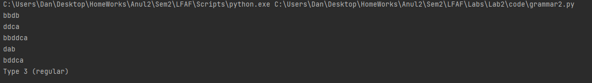
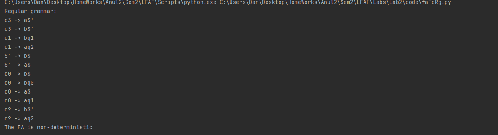

# Laboratory Work 2

### Course: Formal Languages & Finite Automata
### Author: Hariton Dan

----


## Objectives:

* Understand what an automaton is and what it can be used for.


* Continuing the work in the same repository and the same project, the following need to be added: 

    a. Provide a function in your grammar type/class that could classify the grammar based on Chomsky hierarchy.

    b. For this you can use the variant from the previous lab.


* According to your variant number (by universal convention it is register ID), get the finite automaton and do the following tasks:

    a. Implement conversion of a finite automaton to a regular grammar.
  
    b. Determine whether your FA is deterministic or non-deterministic.
    
    c. Implement some functionality that would convert an NDFA to a DFA.
    
    d. Represent the finite automaton graphically (Optional, and can be considered as a bonus point):
      
        - You can use external libraries, tools or APIs to generate the figures/diagrams.
        - Your program needs to gather and send the data about the automaton and the lib/tool/API return the visual representation.

## Implementation description

* Since I left comments on my code I didn't left any comments here.

  For the conversion from NDFA TO DFA implementation, I tried to implement it but I did get a lot of error the code in
  in the /test2.py file


* Grammar Code snippets with Chomsky hierarchy
```
def chomsky_hierarchy(grammar):
    # Check if the grammar is Type 3 (regular)
    if all(len(production) <= 2 and (production[0].islower() or production[0].isupper()) and
           (len(production) == 1 or production[1].isupper() or production[1] == 'ε') for symbol in grammar for
           production in grammar[symbol]):
        return "Type 3 (regular)"
```
* FA TO RG Code snippets
```
def fa_to_rg(Q, Sigma, delta, q0, F):
    # Step 1: Initialize the productions and nonterminals
    productions = defaultdict(list)
    nonterminals = set()
    for q in Q:
        nonterminals.add(q)

    # Step 2: Add the productions for the starting state
    start_productions = []
    for symbol, next_state in delta[q0].items():
        if next_state in F:
            start_productions.append(symbol + "S'")
        else:
            start_productions.append(symbol + "S")
        productions[q0].append(symbol + "S")

    if start_productions:
        nonterminals.add("S'")
        productions["S'"].extend(start_productions)

    # Step 3: Add the productions for the remaining states
    for q in Q:
        for symbol, next_state in delta[q].items():
            if next_state in F:
                productions[q].append(symbol + "S'")
            else:
                productions[q].append(symbol + next_state)
```

* FA (DFA OR NDFA) function 
```
def is_deterministic(Q, Sigma, delta):
    for state in Q:
        next_states = [delta[state][symbol] for symbol in Sigma]
        if len(set(next_states)) != len(Sigma):
            return False
    return True
```

## Conclusions / Screenshots / Results
* Results for the Grammar code with the Chomsky Hierarchy



* Results for the FA code with the determine the type of FA function.

